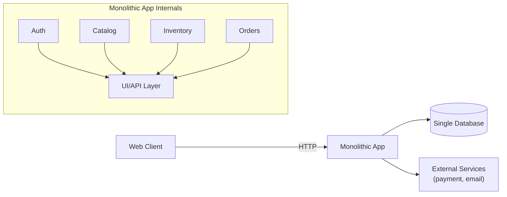
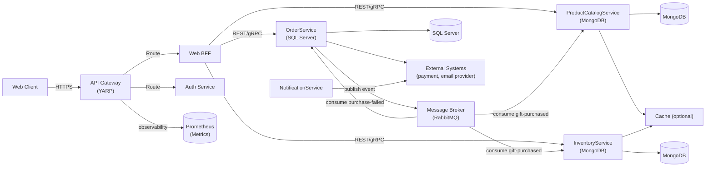

# Architecture Document — Refactoring to Microservices

## 1. Monolith Baseline (Task 1.3)

### Description
The original system is a classical monolithic e‑commerce application where User management, Product Catalog, Inventory, and Order processing are implemented within a single runtime and backed by a single database. All UI clients (web) interact directly with the monolith which exposes REST endpoints and performs business, persistence, and integration logic in the same process. Operational concerns (authentication, logging, scaling) are handled globally rather than per-domain.

### Key API endpoints (representative)
- `GET /products` — list products
- `GET /products/{id}` — product details
- `POST /orders` — create a new order / checkout
- `GET /orders/{id}` — fetch order status
- `POST /auth/login` — authenticate user
- `GET /inventory/tickets` — list tickets / availability
- `POST /users` — create user
- `PUT /users/{id}` — update user profile

### Three core architectural problems at scale
1. **Deployment coupling:** Any change (bug fix, new feature, dependency update) requires building and redeploying the entire monolith. This increases risk and reduces release velocity; small teams cannot independently evolve features without affecting unrelated domains.
2. **Resource contention and scalability limits:** All modules share the same process and database; a bottleneck in one domain (e.g., heavy catalog queries or inventory batch jobs) consumes CPU, memory, or DB connections and degrades the entire system. Vertical scaling becomes the only practical short-term response, which is costly and brittle.
3. **Single point of failure and reliability:** A runtime crash, heavy GC pause, or DB outage compromises user sessions, ordering, notifications, and inventory simultaneously. The monolith lacks fine-grained fault isolation; partial failures cannot be contained to non-critical subsystems.

### Visual (Monolith)

---

## 2. Architecture Decision Records (ADRs)

This document fulfills the course deliverable: a 2–4 page architecture document containing a final diagram, the ADRs required by Task 2.4 (database decisions), and a messaging-technology comparison grounded in the repository implementation.

Deliverable checklist (this file)
- Final architecture diagram and mermaid flowchart: see Section 4 (Final Architecture Diagram).
- ADRs for database choices (Task 2.4): ADR 1 (OrderService/SQL Server), ADR 2 (ProductCatalog/MongoDB), ADR 3 (Inventory/MongoDB) with repo-backed evidence and CAP/ACID/BASE reasoning.
- Messaging comparison: RabbitMQ vs alternatives and concrete code-based evidence from the implemented messaging and consumer patterns.
- Implementation evidence: architecture decisions are grounded in the actual service startup code, database wiring, and messaging setup present in the repository.

The following ADRs document key architectural choices for the refactor. ADRs 1–5 are taken from the project ADR file; ADRs 6–8 are decisions added to cover gateway, BFF, and load balancing.

### ADR 1: OrderService uses SQL Server

**Status:** Accepted

**Context**
OrderService manages users, authentication, carts, and ticket purchases. These operations must be reliable because they affect purchase data and user state.

**Decision**
Use SQL Server as a relational database for OrderService.

**Reasoning**
This service requires ACID guarantees:
- Atomicity: a purchase must complete fully or fail completely.
- Consistency: ticket and user data must remain valid.
- Isolation: concurrent purchases must not corrupt state.
- Durability: committed purchases must not disappear.

**Consistency Model**
Strong consistency.

**CAP Perspective**
Prefer CP. For money and purchase records, consistency is more important than availability during a partition.

**Consequences**
OrderService remains the source of truth for users and tickets. Checkout logic stays transactional.

---

**Implementation evidence in repo**

- The OrderService startup code configures Entity Framework Core with SQL Server and ensures the database schema is created at application startup.
- The relational model defines users, tickets, and unique/index constraints such as email and correlationId, indicating relational integrity is enforced in code.
- The local compose orchestration includes a SQL Server container and passes the connection string to the order service, demonstrating the project's concrete use of SQL Server for development.

**Why this choice (code-grounded)**

- Money and purchase records require transactional guarantees; the code uses EF Core and SQL Server to implement ACID semantics and schema constraints (unique indexes) rather than relying on eventual consistency. This is visible in the order service startup and in the database configuration for the order domain.

### ADR 2: ProductCatalogService uses MongoDB

**Status:** Accepted

**Context**
ProductCatalogService stores gifts and donors. Gift data can vary by category and may include optional attributes like description, category, winner ticket, and draw state.

**Decision**
Use MongoDB as a document database for ProductCatalogService.

**Reasoning**
The catalog fits the document model because gift records are flexible and do not need a rigid relational schema. MongoDB supports this well and works naturally with BASE-style behavior for read-heavy catalog data.

**Consistency Model**
Eventual consistency is acceptable for catalog reads.

**CAP Perspective**
Favor flexibility and availability for reads, while keeping enough consistency for updates.

**Consequences**
New gift fields can be added with minimal schema changes. The catalog is easier to evolve than a rigid relational design.

---

**Implementation evidence in repo**

- The ProductCatalogService package configuration includes `express`, `mongoose`, `redis`, and `amqplib`, showing the concrete tech stack used for the catalog service.
- The service startup connects to MongoDB, initializes Redis, and starts RabbitMQ consumers, demonstrating the runtime composition.
- The local compose setup wires the catalog service to MongoDB, RabbitMQ, and Redis for development.

**Why this choice (code-grounded)**

- The catalog contains variable attributes per gift and benefits from a flexible document model. The code uses Mongoose to model documents and Redis to cache read-heavy responses, which supports fast reads and smaller DB load during spikes. The runtime evidence is in the catalog service startup and package configuration that wire up these technologies.

### ADR 3: InventoryService uses MongoDB

**Status:** Accepted

**Context**
InventoryService stores ticket records and supports lottery operations and reporting. Ticket data is naturally document-shaped and can be stored independently from the order database.

**Decision**
Use MongoDB as the database for InventoryService.

**Reasoning**
Inventory data is not the money source of truth. OrderService owns the transactional checkout data. InventoryService mainly tracks tickets and lottery state, so a document database is a good fit. BASE and eventual consistency are acceptable for inventory views and reporting.

**Consistency Model**
Eventual consistency for inventory tracking and lottery reports.

**CAP Perspective**
Prefer AP for resilience and service availability.

**Consequences**
InventoryService can scale independently and store ticket-related data without depending on the SQL schema.

**Implementation evidence in repo**

- The InventoryService package configuration includes `express`, `mongoose`, and `amqplib`, showing the concrete Node.js + MongoDB + RabbitMQ stack for that service.
- The service startup connects to MongoDB and starts its RabbitMQ event consumer, demonstrating the service responsibilities and runtime wiring.
- The local compose setup wires the inventory service to MongoDB and RabbitMQ for development.

**Why this choice (code-grounded)**

- Inventory operations are event-driven and read-heavy for ticket listing/reporting; MongoDB allows flexible document representations and efficient read queries. The code's use of MongoDB and a message consumer (see `startOrderEventsConsumer`) shows the service expects asynchronous event inputs and does not require strong distributed transactions.

---

### ADR 4 (RabbitMQ) — Decision

Decision
Use RabbitMQ topic exchanges for choreography and event propagation. The implementation publishes domain-level routing keys on a durable exchange and consumes inventory outcomes on a durable, bound queue which implements confirm/compensate logic.

Reasoning

- The publisher declares the topic exchange, publishes JSON payloads with routing keys such as `order.events.gift-purchased`, `order.events.order-placed`, `order.events.inventory-reserved`, `order.events.inventory-rejected`, `order.events.order-finalized`, and `order.events.purchase-failed`. Messages are marked persistent and carry correlation metadata for traceability.
- The consumer-side saga logic declares the same exchange, creates a durable queue for inventory outcomes, binds queues for reservation and rejection events, sets a prefetch limit, uses an async consumer, inspects routing keys, deserializes strongly-typed event payloads, and executes confirm or compensate flows that update domain state and publish follow-up events. The consumer uses explicit acknowledgements on success and nacks with requeue on failure.
- The ProductCatalog consumer mirrors this approach and implements explicit deduplication: it asserts the same exchange, binds the relevant event queues, sets channel prefetch, and persists a processed-event ledger to prevent duplicate processing before applying side effects.
- These concrete code-level decisions (durable topic exchange, routing keys, persistent messages, correlation-id propagation, consumer prefetching, explicit ack/nack behavior, and a processed-event ledger) demonstrate why RabbitMQ fits this project: the code relies on RabbitMQ’s routing semantics and durable delivery to implement an at-least-once choreography saga with traceable correlations and controlled consumer throughput.

---

### ADR 5: Idempotency and compensation strategy for async purchase events

**Status:** Accepted

**Context**
With at-least-once delivery, duplicate event delivery can occur. Without idempotency, counters and ticket projections can drift.

**Decision**
Apply idempotency per consumer and add compensation event handling.

**Reasoning**
- ProductCatalogService uses a ProcessedEvent ledger keyed by `eventId` to prevent duplicate increments/decrements.
- InventoryService relies on Mongo upsert uniqueness by `ticketId` for `gift-purchased` and idempotent delete by `ticketId` for compensation.
- OrderService publishes `purchase-failed` to trigger rollback behavior when needed.

**Consequences**
- Consumers remain safe under retries and broker redelivery.
- Additional storage/logic is required for deduplication in ProductCatalogService.
- Compensations are explicit and auditable through event logs.

---

### ADR 6 (API Gateway — YARP) — Decision

Decision
Use YARP as the API Gateway (reverse proxy) to centralize routing and JWT validation, loading routes from configuration so the gateway enforces authentication and routes client paths to internal clusters.

Reasoning

- The gateway uses Microsoft YARP with configuration-driven reverse proxy routing and a proxy middleware pipeline. Route-to-cluster mappings map client paths such as `/api/auth/{**catch-all}`, `/api/customer/{**catch-all}`, `/api/inventory/{**catch-all}`, `/api/gift/{**catch-all}`, and `/api/bff/{**catch-all}` to internal service destinations.
- Authentication is centralized in the gateway pipeline using JWT Bearer validation with a symmetric key, issuer, and audience settings. The gateway applies authentication and authorization policies to protected routes, exposes health checks, and registers CORS policies for browser access.
- Because the gateway performs config-driven path routing and central JWT enforcement, YARP is a practical choice: it applies route definitions at runtime, validates tokens once in the proxy pipeline, and forwards authenticated requests to internal clusters. This ADR is grounded in the gateway’s routing and auth behaviors implemented in the project.

---

### ADR 7 (BFF) — Decision

Decision
Implement a Web BFF that aggregates authenticated, view-specific data from `OrderService` and `ProductCatalogService` and returns one composed payload to the client.

Reasoning

- The BFF exposes an authenticated endpoint for order details and delegates aggregation to a backend service layer.
- The service layer requests user tickets from OrderService while forwarding the client’s authorization header. For each ticket with a gift reference, it concurrently requests gift metadata from ProductCatalogService and assembles a composed payload that includes ticket and gift details.
- These behaviors — a single authenticated endpoint, server-side composition of order and catalog data, forwarding auth headers, and concurrency for backend calls — are why the BFF was chosen: it reduces client-side orchestration and network round trips by delivering a single aggregated, client-ready response.

---

### ADR 8: Load balancing and replica strategy for ProductCatalogService

**Status:** Accepted

**Context**
ProductCatalogService is read-heavy and must remain available during maintenance windows and high traffic (promotions, draws). Single-instance hosting risks downtime and poor distribution of requests.

**Decision (selected technology)**
For the architecture design, `Nginx` is the chosen load balancing technology for ProductCatalogService. The project’s production-grade topology assumes Nginx will sit in front of the `product-catalog-service` replicas and distribute traffic using a round-robin algorithm. The current repository provides the service implementation and local compose setup, while Nginx is stated here as the selected load balancer for the production architecture.

**Reasoning (why Nginx)**
- Nginx is a mature, high-performance reverse proxy and load balancer that is widely adopted in containerized microservice architectures.
- It efficiently handles SSL/TLS termination, HTTP routing, and load balancing with low resource overhead.
- Nginx is industry standard for this type of deployment and is preferred over alternatives like Traefik or HAProxy when reliability, performance, and predictable request distribution are priorities.
- Its stability and broad ecosystem make it particularly well suited for a service mesh fronting multiple product catalog replicas.

**Connection to the project**
- In the intended architecture, Nginx would sit in front of the product catalog service replicas defined in the compose deployment, ensuring balanced traffic distribution across containers.
- The load balancer would use round-robin scheduling to distribute requests evenly among catalog replicas, which helps avoid hot spots and improves response consistency.
- This integration keeps the load balancer separate from the application containers and complements the stateless design of `ProductCatalogService`.

**Consistency Model**
Reads from the catalog may be eventually consistent due to Redis caching and MongoDB replication in production (if configured). In the repository (single-replica compose setup) reads reflect the single MongoDB instance defined for `mongodb-catalog`.

**CAP Perspective**
For catalog reads the design favors availability and practical performance (AP-style) when scaled with replicas and cache; the repo's development setup uses a single DB instance for simplicity.

**Consequences (explicit repo state)**
- The repository demonstrates a working development environment (single container + MongoDB + Redis + RabbitMQ) suitable for local testing and grading evidence, but it does not include the actual Nginx load balancer or multiple catalog replicas in its current files.
- If Task 3.3 requires demonstrable load balancing, the next step is to add a simple Nginx service and duplicate product catalog replicas in the compose deployment or to provide Kubernetes manifests. This document records Nginx as the selected load balancing technology for the production architecture.

---

## 3. Messaging-Technology Comparison

### Why RabbitMQ for the choreography saga pattern
- **Ease of operation / local setup:** RabbitMQ runs easily in Docker and offers mature images, management UI, and simple single-node setups suitable for local development and CI. It requires minimal configuration to get durable queues and exchanges working.
- **Durable queues & command/event fan-out:** RabbitMQ supports durable queues, message acknowledgements, and flexible exchange types (topic, direct, fanout) that fit event-driven choreography where a single event is consumed by multiple services. Routing keys provide fine-grained fan‑out semantics for domain events.
- **Fit for project needs (performance and decoupling):** The system emphasizes correctness (at-least-once delivery) with idempotent consumers and compensation flows rather than streaming large event volumes. RabbitMQ’s lower operational complexity and native routing model match this project's choreography approach.

### Comparison with alternatives
- **Kafka**
  - Strengths: High throughput, durable append-only log, strong stream-processing semantics, long retention, partitioned scaling.
  - Trade-offs: Operational complexity (cluster management), more complex local development, different semantics (log-based offsets vs queue delivery). Kafka is better for high-throughput event streaming and stream processing than for simple command/event fan-out with at-least-once consumer semantics.
  - Why not chosen: Project does not require long-term event retention or stream processing at Kafka scale; RabbitMQ provides simpler routing and quicker setup.

- **Synchronous HTTP**
  - Strengths: Simplicity, direct call/response guarantees, familiar debugging.
  - Trade-offs: Tight coupling, higher end-to-end latency for multi-service operations, cascading failures, and reduced resiliency (downstream outages affect originating request).
  - Why not chosen: The choreographed purchase flow must avoid cascading failures and long blocking requests; asynchronous messaging decouples persistence from side-effect propagation and improves overall availability.

**Summary:** RabbitMQ offers the best trade-off for this project's requirements: straightforward local/docker operation, durable queues, flexible routing for choreography, and operational simplicity aligned with at-least-once delivery and idempotent consumer design.

The choice is grounded in the code: the project implements publisher logic in the order service, a saga consumer for inventory outcomes, and an idempotent product catalog consumer for event processing.

---

## 4. Final Architecture Diagram

### Notes and Rationale
- `OrderService` is the transactional source of truth and publishes domain events to `RabbitMQ` after committing local transactions.
- Downstream consumers (`ProductCatalogService`, `InventoryService`, `NotificationService`) subscribe to topic exchanges and implement idempotency and compensation flows.
- `API Gateway` centralizes security and cross-cutting concerns; `BFF` minimizes client round trips and composes view-specific payloads.
- `Redis` is optional for caching high-read endpoints (catalog, inventory) and reducing DB load.

---

## Conclusion and Rationale
- The refactor moves from a brittle, resource‑coupled monolith to a set of domain-focused microservices that allow independent scaling, deployment, and fault isolation.
- The combination of an API Gateway + BFF addresses operational and client-performance concerns while preserving clear ownership of data and responsibilities.
- RabbitMQ-based choreography provides an operationally light, decoupled mechanism for propagating side effects from the authoritative `OrderService`, enabling eventual consistency while ensuring the checkout operation remains fast and reliable.
- The chosen ADRs and trade-offs prioritize business correctness (transactional OrderService), developer productivity (simple local RabbitMQ, YARP/Ocelot), and runtime resilience (replicated catalog, idempotent consumers, load-balanced replicas).

---